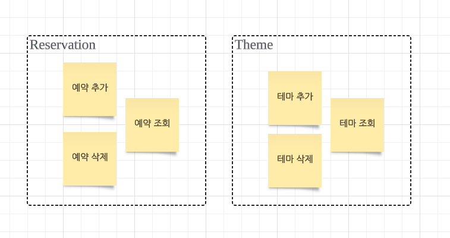

<!-- TOC -->
* [요구사항](#요구사항)
  * [예약](#예약)
    * [예약 관리](#예약-관리)
    * [예약 시간 관리](#예약-시간-관리)
  * [테마](#테마-)
* [기술 과제](#기술-과제)
<!-- TOC -->

# 요구사항

## 예약

### 예약 관리

- [x] 예약 추가
  - [ ] `예약자 이름`과 `시간&날짜`, `테마`를 통해 예약을 추가할 수 있다.
    - [ ] `예약자 이름`과 `시간&날짜`, `테마`는 필수로 저장되어야한다.
    - 모든 테마의 시작 시간과 소요 시간은 동일하다고 가정한다.
- [x] 예약 목록 조회
  - [x] 모든 예약 목록을 조회할 수 있다.
    - [x] 취소된 예약은 예약 목록에서 조회할 수 없다.
- [x] 예약 취소
  - [x] 예약을 단건 별로 취소할 수 있다. 

### 예약 시간 관리

- [x] 예약 시간 추가
  - [x] 시작 시간을 이용하여 예약 시간을 추가할 수 있다.
  - [x] 시간 추가 시 기존 시간이 있다면 예외가 발생한다.
- [x] 예약 시간 목록 조회 
  - [x] 전체 예약 시간을 조회할 수 있다.
- [x] 예약 시간 삭제
  - [x] 예약 시간을 삭제할 수 있다.
  - [x] 예약 시간 삭제 시 이미 해당 시간으로 예약된 예약이 존재한다면 예외가 발생한다.

## 테마 

- [ ] 테마 추가
  - [ ] `테마 이름`, `테마 설명`, `테마 썸네일 웹 주소`를 통해 테마를 추가할 수 있다.
    - [ ] `테마 이름`, `테마 설명`, `테마 썸네일 웹 주소`는 필수로 저장되어야한다.
- [ ] 테마 목록 조회
  - [ ] 전체 테마 목록을 조회할 수 있다.
- [ ] 테마 삭제
  - [ ] 테마를 단건으로 삭제할 수 있다.

---

# 기술 과제

- [x] 도메인 모델, DB 엔티티 분리
- [x] 멀티 모듈로 분리 DB 엔티티 의존성 격리 (core:core-api, storage:db-core)
- ~~간접 참조로 변경~~

